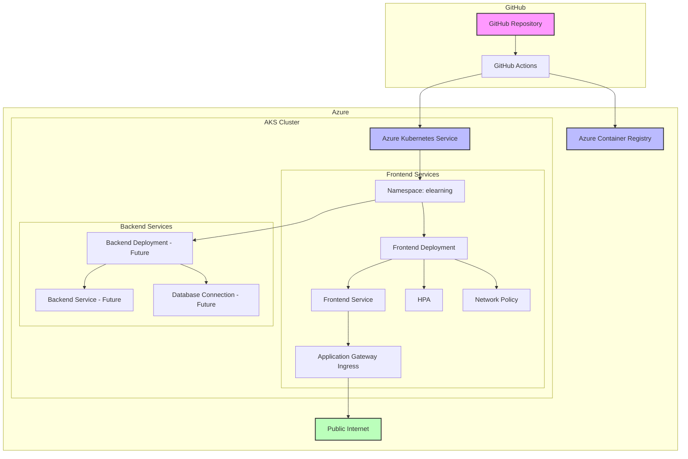

# Azure AKS Deployment Guide

This document provides a comprehensive guide for deploying the E-Learning platform to Azure Kubernetes Service (AKS).

## 🏗️ Architecture Overview



## 📁 Project Structure

```
deployment/aks/
├── frontend/                   # Frontend deployment manifests
│   ├── 01-namespace.yaml      # Kubernetes namespace
│   ├── 02-configmap.yaml     # Configuration management
│   ├── 03-deployment.yaml    # Application deployment
│   ├── 04-service.yaml       # Service definitions
│   ├── 05-ingress.yaml       # Ingress controllers
│   ├── 06-hpa.yaml           # Auto-scaling configuration
│   ├── 07-network-policy.yaml # Network security
│   ├── deploy.sh             # Deployment script
│   └── README.md             # Frontend deployment docs
└── README.md                 # This document
```

## 🚀 Deployment Strategy

### 1. Containerization
- **Frontend**: Multi-stage Docker build with Nginx
- **Security**: Non-root user, read-only filesystem
- **Optimization**: Compressed assets, health checks

### 2. Kubernetes Manifests
- **Namespace Isolation**: Dedicated `elearning` namespace
- **ConfigMap Management**: Environment-specific configuration
- **Resource Management**: CPU/Memory requests and limits
- **Auto-scaling**: HPA based on CPU and memory metrics
- **Network Security**: Network policies for traffic control

### 3. Service Exposure
- **Internal Service**: ClusterIP for internal communication
- **External Service**: LoadBalancer for external access
- **Ingress Options**: Azure Application Gateway or Nginx

### 4. CI/CD Pipeline
- **Automated Builds**: GitHub Actions triggered on push
- **Security Scanning**: Container vulnerability assessment
- **Automated Deployment**: Zero-downtime rolling updates

## 🛡️ Security Implementation

### Container Security
- ✅ Non-root user execution
- ✅ Read-only root filesystem
- ✅ Minimal base image (Alpine Linux)
- ✅ No sensitive data in images
- ✅ Regular security scanning

### Kubernetes Security
- ✅ Network policies for traffic isolation
- ✅ Resource quotas and limits
- ✅ Pod security context restrictions
- ✅ Service account restrictions
- ✅ Secrets management

### Application Security
- ✅ Security headers (CSP, HSTS, etc.)
- ✅ CORS configuration
- ✅ Rate limiting
- ✅ SSL/TLS termination
- ✅ Input validation

## 📊 Monitoring & Observability

### Health Monitoring
- **Liveness Probes**: Detect and restart unhealthy containers
- **Readiness Probes**: Control traffic routing to healthy pods
- **Startup Probes**: Handle slow-starting applications

### Metrics Collection
- **Prometheus Integration**: Service discovery and metrics collection
- **Resource Monitoring**: CPU, memory, and network usage
- **Application Metrics**: Custom business metrics (future)

### Logging
- **Structured Logging**: JSON format for better parsing
- **Log Aggregation**: Centralized log collection (future)
- **Log Retention**: Configurable retention policies

## 🔄 Auto-scaling Configuration

### Horizontal Pod Autoscaler (HPA)
```yaml
Metrics:
  - CPU Utilization: 70% target
  - Memory Utilization: 80% target

Scaling Behavior:
  - Min Replicas: 2
  - Max Replicas: 10
  - Scale Up: Aggressive (100% in 15s)
  - Scale Down: Conservative (10% in 60s)
```

### Pod Disruption Budget (PDB)
```yaml
Min Available: 1 pod
Purpose: Ensure availability during updates
```

## 🌐 Ingress Configuration

### Azure Application Gateway (Recommended)
- **Features**: SSL termination, WAF protection, health probes
- **Integration**: Native Azure integration
- **Scalability**: Auto-scaling capabilities
- **Use Case**: Production Azure environments

### Nginx Ingress Controller (Alternative)
- **Features**: Rate limiting, CORS, advanced routing
- **Portability**: Works across cloud providers
- **Customization**: Extensive configuration options
- **Use Case**: Multi-cloud or on-premises deployments

## 📋 Environment Configuration

### Production Settings
```yaml
Replicas: 3 (minimum)
Resources:
  CPU: 100m request, 500m limit
  Memory: 128Mi request, 512Mi limit
Image Pull Policy: Always
Environment: production
Log Level: info
```

### Development Settings
```yaml
Replicas: 1
Resources:
  CPU: 50m request, 200m limit
  Memory: 64Mi request, 256Mi limit
Image Pull Policy: IfNotPresent
Environment: development
Log Level: debug
```

## 🔧 Prerequisites

### Azure Resources
1. **Azure Subscription** with appropriate permissions
2. **Resource Group** for organizing resources
3. **Azure Kubernetes Service (AKS)** cluster
4. **Azure Container Registry (ACR)** for image storage
5. **Azure Application Gateway** (optional, for AGIC)

### Development Tools
1. **Azure CLI** (`az`) installed and configured
2. **kubectl** installed and configured
3. **Docker** installed for local testing
4. **GitHub** repository with Actions enabled

### AKS Cluster Requirements
```bash
# Minimum cluster configuration
Node Pool: 2-3 nodes
VM Size: Standard_B2s or larger
Kubernetes Version: 1.24+
Network Plugin: Azure CNI (recommended)
Load Balancer: Standard SKU
```

## 🚀 Deployment Procedures

### Initial Setup

1. **Create Azure Resources**:
```bash
# Create resource group
az group create --name rg-elearning --location eastus

# Create AKS cluster
az aks create \
  --resource-group rg-elearning \
  --name aks-elearning \
  --node-count 2 \
  --node-vm-size Standard_B2s \
  --enable-managed-identity \
  --network-plugin azure

# Create ACR
az acr create \
  --resource-group rg-elearning \
  --name acrelearning \
  --sku Basic
```

2. **Configure GitHub Secrets**:
```bash
# Required secrets for GitHub Actions
AZURE_CREDENTIALS          # Service principal credentials
AZURE_REGISTRY_NAME         # ACR name
AZURE_RESOURCE_GROUP        # Resource group name
AZURE_AKS_CLUSTER          # AKS cluster name
```

3. **Connect AKS to ACR**:
```bash
az aks update \
  --name aks-elearning \
  --resource-group rg-elearning \
  --attach-acr acrelearning
```

### Application Deployment

1. **Automated Deployment** (Recommended):
   - Push code to `main` branch
   - GitHub Actions automatically builds and deploys
   - Monitor deployment in GitHub Actions tab

2. **Manual Deployment**:
```bash
# Navigate to frontend deployment directory
cd deployment/aks/frontend/

# Run deployment script
./deploy.sh

# Check status
./deploy.sh status

# View logs
./deploy.sh logs
```

### Post-Deployment Verification

1. **Check Cluster Health**:
```bash
kubectl get nodes
kubectl get pods -A
kubectl top nodes
```

2. **Verify Application**:
```bash
kubectl get all -n elearning
kubectl get ingress -n elearning
```

3. **Access Application**:
   - Get external IP from LoadBalancer service
   - Configure DNS (if using custom domain)
   - Test application functionality

## 🔍 Troubleshooting

### Common Issues

1. **Pod Stuck in Pending**:
   - Check resource availability: `kubectl describe nodes`
   - Verify resource requests: `kubectl describe pod <pod-name> -n elearning`

2. **Image Pull Errors**:
   - Check ACR integration: `az aks check-acr`
   - Verify image exists: `az acr repository list --name <acr-name>`

3. **Service Not Accessible**:
   - Check service endpoints: `kubectl get endpoints -n elearning`
   - Verify network policies: `kubectl describe networkpolicy -n elearning`

4. **Ingress Issues**:
   - Check ingress controller: `kubectl get pods -n kube-system`
   - Verify ingress configuration: `kubectl describe ingress -n elearning`

### Debug Commands
```bash
# Comprehensive cluster status
kubectl get all -n elearning
kubectl get events -n elearning --sort-by='.lastTimestamp'

# Application logs
kubectl logs -n elearning -l app=elearning-frontend --tail=100 -f

# Resource usage
kubectl top pods -n elearning
kubectl top nodes

# Network debugging
kubectl exec -it -n elearning deployment/elearning-frontend-deployment -- /bin/sh
```

## 📈 Scaling and Optimization

### Performance Tuning
1. **Resource Right-sizing**: Monitor actual usage and adjust requests/limits
2. **Node Pool Optimization**: Use appropriate VM sizes for workloads
3. **Image Optimization**: Minimize image sizes and layers
4. **Caching Strategies**: Implement CDN and browser caching

### Cost Optimization
1. **Auto-scaling**: Use HPA and cluster autoscaler
2. **Reserved Instances**: Purchase reserved capacity for predictable workloads
3. **Spot Instances**: Use spot VMs for development environments
4. **Resource Monitoring**: Regular review and optimization

## 🔄 Maintenance and Updates

### Regular Maintenance
- **Kubernetes Updates**: Keep cluster and node pools updated
- **Image Updates**: Regular security updates for base images
- **Dependency Updates**: Update application dependencies
- **Backup Strategy**: Regular backup of configuration and data

### Deployment Updates
- **Rolling Updates**: Zero-downtime deployment strategy
- **Blue-Green Deployments**: Alternative deployment strategy for critical updates
- **Canary Deployments**: Gradual rollout for risk mitigation

## 📚 Additional Resources

### Azure Documentation
- [Azure Kubernetes Service](https://docs.microsoft.com/en-us/azure/aks/)
- [Azure Container Registry](https://docs.microsoft.com/en-us/azure/container-registry/)
- [Azure Application Gateway Ingress Controller](https://docs.microsoft.com/en-us/azure/application-gateway/ingress-controller-overview)

### Kubernetes Resources
- [Kubernetes Documentation](https://kubernetes.io/docs/)
- [kubectl Reference](https://kubernetes.io/docs/reference/kubectl/)
- [Best Practices](https://kubernetes.io/docs/concepts/configuration/overview/)

### Security Resources
- [CIS Kubernetes Benchmark](https://www.cisecurity.org/benchmark/kubernetes)
- [Pod Security Standards](https://kubernetes.io/docs/concepts/security/pod-security-standards/)
- [Network Policies](https://kubernetes.io/docs/concepts/services-networking/network-policies/)

## 🤝 Support and Contribution

For questions, issues, or contributions:
1. Check existing documentation and troubleshooting guides
2. Review application logs and cluster events
3. Contact the development team with detailed information
4. Contribute improvements via pull requests

---

**Last Updated**: December 2024  
**Version**: 1.0  
**Maintainer**: E-Learning Development Team
