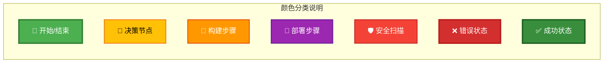
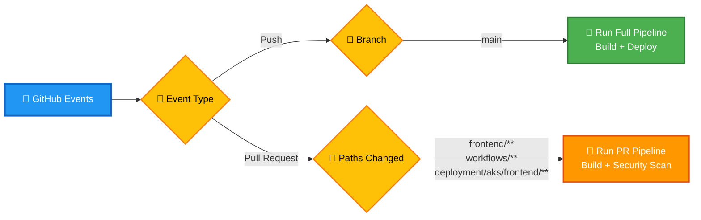
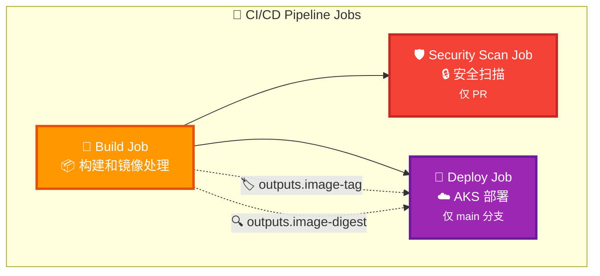
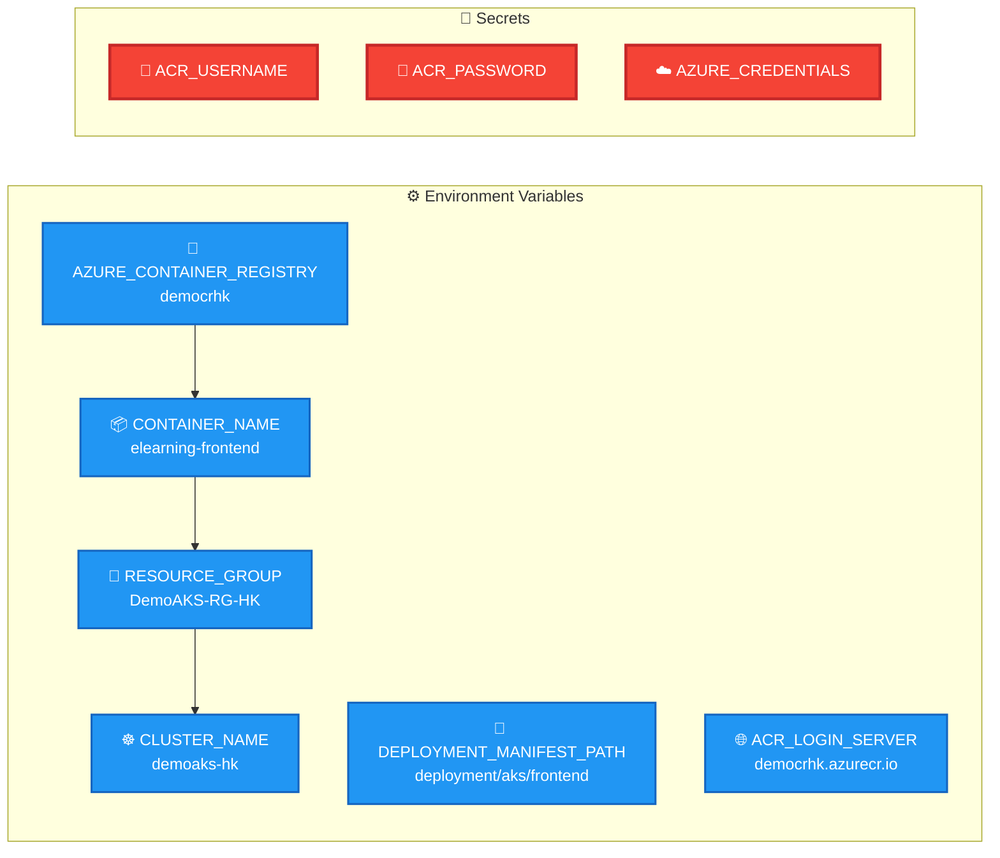
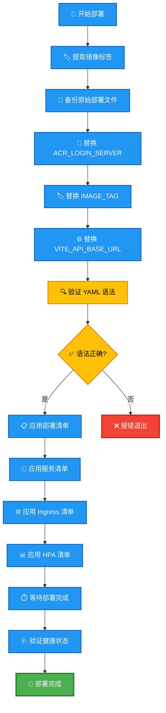

# Frontend CI/CD - Azure AKS Workflow

## 🎨 颜色图例

## Mermaid 流程图

### 完整工作流程图

```mermaid
graph TD
    Start([🚀 开始]) --> Trigger{🎯 触发事件}
    
    %% 触发条件
    Trigger -->|Push to main| MainFlow[📦 主分支流程]
    Trigger -->|Pull Request| PRFlow[🔄 PR流程]
    
    %% 通用构建步骤
    MainFlow --> Build[🔨 Build Job]
    PRFlow --> Build
    
    Build --> Checkout[📥 Checkout 代码]
    Checkout --> NodeSetup[⚙️ 设置 Node.js 22]
    NodeSetup --> Cache[💾 缓存 NPM 依赖]
    Cache --> Install[📦 安装依赖 npm ci]
    Install --> TypeCheck[🔍 类型检查]
    TypeCheck --> BuildApp[🏗️ 构建应用]
    
    %% 判断是否需要推送镜像
    BuildApp --> ShouldPush{❓ 是否为 main 分支?}
    
    %% main 分支流程
    ShouldPush -->|是| ACRLogin[🔐 登录 Azure Container Registry]
    ACRLogin --> ExtractMeta[🏷️ 提取 Docker 镜像元数据]
    ExtractMeta --> BuildPush[📤 构建并推送 Docker 镜像]
    
    %% PR 流程
    ShouldPush -->|否| ExtractMetaPR[🏷️ 提取 Docker 镜像元数据 - PR]
    ExtractMetaPR --> BuildOnly[🔨 仅构建 Docker 镜像]
    
    %% 安全扫描 Job (仅 PR)
    BuildOnly --> SecurityScan[🛡️ Security Scan Job]
    SecurityScan --> TrivyScan[🔒 Trivy 安全扫描]
    
    %% 部署 Job (仅 main 分支)
    BuildPush --> Deploy[🚀 Deploy Job]
    Deploy --> CheckoutDeploy[📥 Checkout 代码]
    CheckoutDeploy --> AzureLogin[☁️ Azure 登录]
    AzureLogin --> SetupKubectl[⚙️ 设置 kubectl]
    SetupKubectl --> GetAKSCreds[🔑 获取 AKS 凭据]
    GetAKSCreds --> CreateNamespace[📁 创建命名空间]
    CreateNamespace --> ApplyConfigMaps[⚙️ 应用 ConfigMaps]
    ApplyConfigMaps --> ExtractImageTag[🏷️ 提取镜像标签]
    ExtractImageTag --> UpdateDeployment[📝 更新部署清单]
    UpdateDeployment --> DeployApp[🚀 部署应用]
    DeployApp --> WaitRollout[⏱️ 等待部署完成]
    WaitRollout --> VerifyHealth[✅ 验证部署健康状态]
    
    %% 结束
    TrivyScan --> EndPR([🎉 PR 流程结束])
    VerifyHealth --> EndMain([✨ 主分支流程结束])
    
    %% 样式定义 - 使用更鲜明的颜色
    classDef startClass fill:#4CAF50,stroke:#2E7D32,stroke-width:3px,color:#fff
    classDef triggerClass fill:#2196F3,stroke:#1565C0,stroke-width:2px,color:#fff
    classDef buildClass fill:#FF9800,stroke:#E65100,stroke-width:2px,color:#fff
    classDef deployClass fill:#9C27B0,stroke:#6A1B9A,stroke-width:2px,color:#fff
    classDef securityClass fill:#F44336,stroke:#C62828,stroke-width:2px,color:#fff
    classDef endClass fill:#4CAF50,stroke:#2E7D32,stroke-width:3px,color:#fff
    classDef decisionClass fill:#FFC107,stroke:#F57F17,stroke-width:2px,color:#000
    
    class Start startClass
    class Trigger,ShouldPush decisionClass
    class MainFlow,PRFlow triggerClass
    class Build,Checkout,NodeSetup,Cache,Install,TypeCheck,BuildApp,ACRLogin,ExtractMeta,BuildPush,ExtractMetaPR,BuildOnly buildClass
    class Deploy,CheckoutDeploy,AzureLogin,SetupKubectl,GetAKSCreds,CreateNamespace,ApplyConfigMaps,ExtractImageTag,UpdateDeployment,DeployApp,WaitRollout,VerifyHealth deployClass
    class SecurityScan,TrivyScan securityClass
    class EndPR,EndMain endClass
```

### 触发条件图

### Jobs 依赖关系图

### 环境变量和配置图

### 部署清单更新流程

## 工作流程说明

### 触发条件
- **Push 到 main 分支**: 执行完整的 CI/CD 流程（构建 + 部署）
- **Pull Request**: 执行 CI 流程（构建 + 安全扫描）
- **路径过滤**: 仅当以下路径发生变化时触发
  - `frontend/**`
  - `.github/workflows/frontend-deploy.yml`
  - `deployment/aks/frontend/**`

### 主要阶段

#### 1. Build Job
- 设置 Node.js 环境
- 安装依赖并进行类型检查
- 构建前端应用
- 根据分支决定是否推送 Docker 镜像到 ACR

#### 2. Security Scan Job (仅 PR)
- 对构建的镜像进行安全扫描
- 使用 Trivy 进行漏洞检测

#### 3. Deploy Job (仅 main 分支)
- 登录 Azure 并获取 AKS 凭据
- 动态更新 Kubernetes 部署清单
- 按顺序部署应用组件
- 验证部署健康状态

### 关键特性
- **条件执行**: 根据分支和事件类型执行不同的流程
- **镜像标签管理**: 自动生成和管理 Docker 镜像标签
- **安全扫描**: PR 阶段进行安全检查
- **健康检查**: 部署后验证应用状态
- **环境隔离**: 使用不同的配置用于不同环境

## 🎨 视觉设计说明

### 颜色方案
本流程图采用了高对比度的颜色方案，确保在不同设备和打印环境下都能清晰可见：

- **🟢 绿色 (#4CAF50)**: 开始/结束节点，表示流程的起始和完成
- **🟡 黄色 (#FFC107)**: 决策节点，表示需要判断的条件分支
- **🟠 橙色 (#FF9800)**: 构建相关步骤，包括代码检出、编译、打包等
- **🟣 紫色 (#9C27B0)**: 部署相关步骤，包括 Azure 登录、Kubernetes 部署等
- **🔴 红色 (#F44336)**: 安全扫描和错误处理步骤
- **🔵 蓝色 (#2196F3)**: 触发条件和环境变量

### 图标说明
为了提高可读性，每个节点都添加了相应的表情符号图标：

- 🚀 部署和启动相关
- 🔨 构建和编译相关
- 🛡️ 安全和保护相关
- ⚙️ 配置和设置相关
- 📦 包管理和依赖相关
- 🔍 检查和验证相关
- 🏷️ 标签和元数据相关
- ☁️ 云服务相关
- 📁 文件和目录相关
- ✅ 成功和完成相关
- ❌ 错误和失败相关

### 边框样式
- **实线粗边框 (3px)**: 重要的开始/结束节点和关键决策点
- **实线中等边框 (2px)**: 一般的处理步骤
- **虚线**: 数据流和输出传递

这种设计确保了流程图在各种环境下都具有良好的可读性和专业外观。
